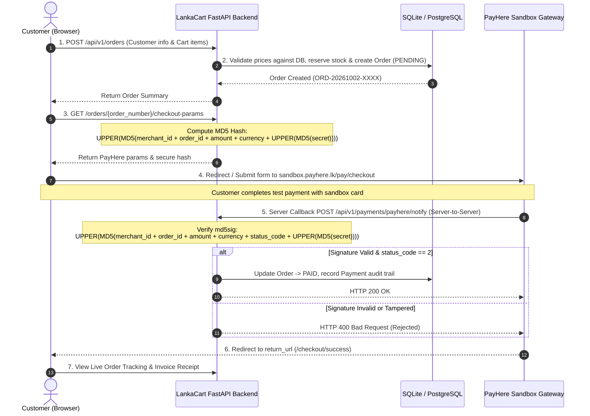

# 🇱🇰 LankaCart — FastAPI & PayHere Sandbox E-Commerce Platform

[](https://www.python.org/)
[](https://fastapi.tiangolo.com/)
[](https://sandbox.payhere.lk/)
[](https://www.sqlalchemy.org/)
[](https://docs.pytest.org/)
[](https://opensource.org/licenses/MIT)

> A full-stack, production-ready Python E-Commerce engine featuring **FastAPI**, **SQLAlchemy**, and complete payment gateway integration with the **PayHere Sandbox (Sri Lanka)**. Demonstrates cryptographically signed checkout hashes, server-to-server webhook callbacks (`notify_url`), signature verification (`md5sig`), and a built-in sandbox simulator.

---

## 🌟 Key Features

- **⚡ Modern FastAPI Architecture**: Clean, production-grade layered design (Routers, Domain Services, SQLAlchemy Models, Pydantic v2 Schemas).
- **💳 Official PayHere Sandbox Integration**:
  - **Server-Side MD5 Hash Generation**: Uses PayHere's exact mathematical formula to keep `merchant_secret` secure.
  - **Server-to-Server Webhook (`notify_url`)**: Handles `application/x-www-form-urlencoded` callbacks from PayHere.
  - **Cryptographic Signature Verification (`md5sig`)**: Prevents man-in-the-middle attacks, payload tampering, and replay attempts.
  - **Automated Order State Machine**: Transitions orders smoothly between `PENDING`, `PROCESSING`, `PAID`, `FAILED`, and `CANCELLED`.
  - **Stock Inventory Control**: Automatically reserves stock on checkout and restores stock if payment fails or is cancelled.
- **🎨 Glassmorphic Responsive Frontend**:
  - **Storefront (`/`)**: Product catalog, category filters, live instant search, and interactive shopping cart drawer.
  - **Checkout Flow (`/checkout`)**: Customer delivery details, authoritative backend pricing check, and PayHere Sandbox redirection.
  - **Live Order Tracking (`/orders/track/{order_number}`)**: Real-time polling, status badge animations, payment audit log, and printable invoice.
  - **Merchant Dashboard & Webhook Simulator (`/admin`)**: Operational analytics (Revenue in LKR, Orders, Conversion Rate) and a **built-in PayHere Webhook Testbed** that simulates authentic signed callbacks with zero external tunnels required!
- **🗄️ Multi-Database Support**: Zero-configuration **SQLite** out-of-the-box; switch to **PostgreSQL** or **MySQL** simply by changing `DATABASE_URL` in `.env`.
- **📮 Postman Collection & Environment**: Pre-configured JSON collection and environment in `/postman` for instant API endpoint testing.
- **🧪 Automated Pytest Suite**: 100% test pass rate covering hash mathematics, signature validation, tampering prevention, and order lifecycles.
- **🐳 Docker Ready**: Multi-stage `Dockerfile` and `docker-compose.yml` included.

---

## 🏗️ Architecture & Payment Workflow



---

## 🔐 The PayHere Cryptographic Hash Formula

PayHere requires strict adherence to its MD5 hashing logic for both initiating checkout and verifying server callbacks.

### 1. Checkout Hash (Server-to-Client)
Calculated on the backend before sending the user to PayHere:
```python
import hashlib

def generate_payhere_hash(merchant_id: str, order_id: str, amount: float, currency: str, merchant_secret: str) -> str:
    # Step 1: MD5 hash the merchant secret and uppercase
    hashed_secret = hashlib.md5(merchant_secret.strip().encode("utf-8")).hexdigest().upper()
    
    # Step 2: Format amount to exactly 2 decimals (e.g., '2850.00')
    formatted_amount = f"{float(amount):.2f}"
    
    # Step 3: Concatenate and hash the final string
    raw_str = f"{merchant_id}{order_id}{formatted_amount}{currency}{hashed_secret}"
    return hashlib.md5(raw_str.encode("utf-8")).hexdigest().upper()
```

### 2. Webhook Signature Verification (`md5sig`) (Server-to-Server)
When PayHere posts to `notify_url`, it includes `status_code` and `md5sig`:
```python
def verify_payhere_signature(merchant_id: str, order_id: str, payhere_amount: str, payhere_currency: str, status_code: str, received_md5sig: str, merchant_secret: str) -> bool:
    hashed_secret = hashlib.md5(merchant_secret.strip().encode("utf-8")).hexdigest().upper()
    sig_raw = f"{merchant_id}{order_id}{payhere_amount}{payhere_currency}{status_code}{hashed_secret}"
    calculated_sig = hashlib.md5(sig_raw.encode("utf-8")).hexdigest().upper()
    return calculated_sig == received_md5sig.strip().upper()
```

### PayHere Status Codes
| Status Code | Meaning | Action Taken by FastAPI |
| :---: | :--- | :--- |
| **`2`** | **SUCCESS** | Order marked as **`PAID`**, payment transaction recorded |
| **`0`** | **PENDING** | Order marked as **`PROCESSING`** |
| **`-1`** | **CANCELED** | Order marked as **`CANCELLED`**, reserved inventory restored to catalog |
| **`-2`** | **FAILED** | Order marked as **`FAILED`**, reserved inventory restored to catalog |
| **`-3`** | **CHARGEDBACK** | Order marked as **`CANCELLED`** |

---

## 🚀 Quickstart Guide

### Prerequisites
- Python 3.10, 3.11, 3.12, or 3.14
- Git

### 1. Clone & Set Up Virtual Environment

```bash
git clone https://github.com/muflamuffathi-creator/payhere-fastapi-ecommerce.git
cd payhere-fastapi-ecommerce

# Create virtual environment
python -m venv venv

# Activate virtual environment
# Windows (PowerShell):
.\venv\Scripts\Activate.ps1
# Windows (cmd):
.\venv\Scripts\activate.bat
# Linux / macOS:
source venv/bin/activate
```

### 2. Install Dependencies

```bash
pip install -r requirements.txt
```

### 3. Configure Environment Variables

Copy `.env.example` to `.env`:
```bash
cp .env.example .env
```
*(Default settings use SQLite and public PayHere Sandbox credentials, so it runs immediately with zero additional configuration!)*

### 4. Run the Application

```bash
uvicorn app.main:app --reload --port 8000
```

The database tables and sample Ceylon catalog will automatically initialize on startup.

---

## 🌐 Application Pages & Endpoints

| URL | Description |
| :--- | :--- |
| **`http://localhost:8000/`** | **Storefront**: Browse products, search, category filter, shopping cart |
| **`http://localhost:8000/checkout`** | **Checkout**: Enter delivery info & proceed to PayHere Sandbox or Simulator |
| **`http://localhost:8000/admin`** | **Admin Dashboard**: Live revenue stats, orders table & PayHere Webhook Testbed |
| **`http://localhost:8000/docs`** | **Swagger UI**: Interactive OpenAPI documentation for all REST endpoints |
| **`http://localhost:8000/redoc`** | **ReDoc**: Alternative interactive API documentation |
| **`http://localhost:8000/health`** | System health check endpoint |

---

## 📡 Live PayHere Sandbox Webhook Setup (with ngrok)

PayHere Sandbox requires a publicly accessible HTTPS URL to send its server callback (`notify_url`).

1. **Install and run ngrok**:
   ```bash
   ngrok http 8000
   ```
2. **Copy the generated HTTPS URL** (e.g., `https://xxxx-xx-xx.ngrok-free.app`).
3. **Update `BASE_URL` in `.env`**:
   ```env
   BASE_URL=https://xxxx-xx-xx.ngrok-free.app
   ```
4. **Test the Checkout**:
   - Go to `http://localhost:8000/checkout`.
   - Click **Pay with PayHere Sandbox Gateway**.
   - On the PayHere gateway, use test credit card:
     - **Card Number**: `4111 1111 1111 1111` (VISA)
     - **Expiry**: `12/28`
     - **CVV**: `123`
     - **OTP**: `123456`
   - PayHere will send the callback directly to your ngrok tunnel, and your FastAPI server will verify the signature and mark the order as **PAID**!

---

## 🧪 Testing

Run the automated test suite with pytest:

```bash
pytest -v
```

All 12 unit and integration tests run against an isolated in-memory SQLite database:
- ✅ `test_generate_checkout_hash_calculation`: Verifies PayHere hash computation formula
- ✅ `test_verify_payhere_signature_valid`: Confirms signature validation logic
- ✅ `test_verify_payhere_signature_tampered`: Confirms rejection of tampered/forged signatures
- ✅ `test_create_order_success`: Tests order creation and stock reservation
- ✅ `test_get_checkout_params_with_hash`: Tests checkout parameter and hash generation
- ✅ `test_payhere_webhook_success_callback`: End-to-end webhook callback test
- ✅ `test_payhere_webhook_invalid_signature_rejection`: Rejection of malicious callbacks
- ✅ `test_simulator_endpoint`: Sandbox simulator testing
- ✅ `test_get_products`, `test_filter_products_by_category`, `test_search_products`: Catalog queries
- ✅ `test_create_and_delete_product`: Product CRUD

---

## 📮 Postman Collection

A complete Postman collection and environment are provided in the `/postman` directory:
1. `postman/PayHere_FastAPI_Ecommerce.postman_collection.json`
2. `postman/PayHere_Local_Environment.postman_environment.json`

### How to Import:
1. Open **Postman**.
2. Click **Import** (top left).
3. Select both JSON files from the `postman/` directory.
4. Select the **PayHere Local Environment** from the environment dropdown.
5. Execute requests in sequence:
   - Run `Create Order` (automatically saves `{{order_number}}` to your environment).
   - Run `Get PayHere Checkout Params & MD5 Hash`.
   - Run `Simulate Successful Payment`.

---

## 🐳 Docker Deployment

Run the entire application using Docker Compose:

```bash
docker-compose up --build -d
```
Access the application at `http://localhost:8000`.

---

## 📂 Project Structure

```
payhere-fastapi-ecommerce/
├── .env.example                                  # Sample environment variables
├── .env                                          # Local environment configuration
├── .gitignore                                    # Git exclusion rules
├── Dockerfile                                    # Multi-stage production container
├── docker-compose.yml                            # Container orchestration
├── README.md                                     # Documentation
├── requirements.txt                              # Python dependencies
├── postman/
│   ├── PayHere_FastAPI_Ecommerce.postman_collection.json
│   └── PayHere_Local_Environment.postman_environment.json
├── tests/
│   ├── conftest.py                               # In-memory test DB & client fixtures
│   ├── test_hash.py                              # PayHere MD5 formula unit tests
│   ├── test_products.py                          # Catalog API tests
│   ├── test_orders.py                            # Order creation & stock tests
│   └── test_payments.py                          # Webhook callback & signature tests
├── app/
│   ├── __init__.py
│   ├── main.py                                   # FastAPI entrypoint & lifespan
│   ├── config.py                                 # Pydantic BaseSettings
│   ├── database.py                               # SQLAlchemy engine & session
│   ├── seed_data.py                              # Sample Sri Lankan artisan catalog
│   ├── models/
│   │   ├── product.py                            # Product entity
│   │   ├── order.py                              # Order & OrderItem entities
│   │   └── payment.py                            # Payment transaction entity
│   ├── schemas/
│   │   ├── product.py                            # Pydantic Product DTOs
│   │   ├── order.py                              # Pydantic Order DTOs
│   │   └── payment.py                            # PayHere Webhook & Checkout DTOs
│   ├── services/
│   │   ├── payhere_service.py                    # MD5 hash & signature cryptography
│   │   ├── order_service.py                      # Order lifecycle & webhook processing
│   │   └── product_service.py                    # Product catalog operations
│   ├── routers/
│   │   ├── products.py                           # /api/v1/products
│   │   ├── orders.py                             # /api/v1/orders
│   │   ├── payments.py                           # /api/v1/payments (webhook notify)
│   │   ├── admin.py                              # /api/v1/admin
│   │   └── views.py                              # HTML storefront & admin routes
│   └── static/
│       ├── css/
│       │   ├── style.css                         # Dark UI design system
│       │   └── admin.css                         # Dashboard & simulator layout
│       └── js/
│           ├── app.js                            # Cart & storefront interactions
│           ├── checkout.js                       # PayHere checkout submission
│           ├── order-status.js                   # Real-time status polling
│           └── admin.js                          # Webhook testbed console
└── templates/
    ├── base.html                                 # Master layout
    ├── index.html                                # Storefront & product catalog
    ├── checkout.html                             # Checkout & payment launcher
    ├── order-status.html                         # Status receipt & tracker
    └── admin.html                                # Merchant dashboard & simulator
```

---

## 👤 Author

Developed by **[Fathima Mufla (muflamuffathi-creator)](https://github.com/muflamuffathi-creator)**.
Feel free to open issues or pull requests for enhancements!
